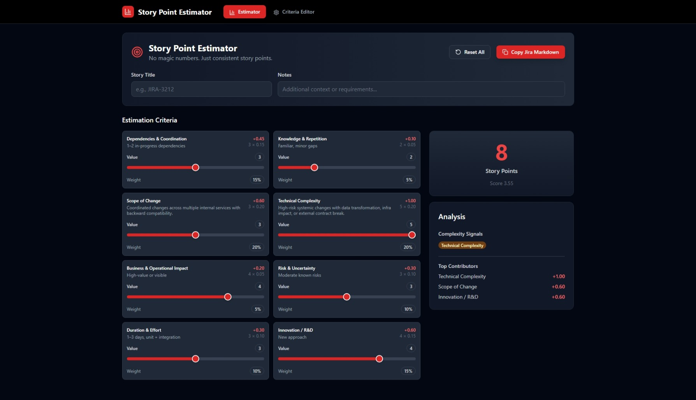

# Story Point Estimator

[](https://ThamalDilanka.github.io/story-point-estimator/)
[](LICENSE)
[](https://reactjs.org/)
[](https://www.typescriptlang.org/)
[](https://vitejs.dev/)

**No magic numbers. Just consistent story points.**

A free, open-source story point calculator for agile teams. Get consistent Fibonacci-based estimations using weighted criteria. Perfect for Scrum teams, sprint planning, and Jira integration.

[](https://ThamalDilanka.github.io/story-point-estimator/)

## 💡 Motivation

- *“Estimating tasks is never perfect, but we can make it more consistent and less confusing. This tool helps teams speak the same language when assigning story points.”*  

- *“I built this to reduce the guesswork in story point estimation. It’s a simple framework to bring more clarity and alignment to teams.”*  

- *“Estimation will always have uncertainty, but it doesn’t have to feel like magic numbers. This project is a small step toward fairer, more consistent story points.”*  

- *My aim isn’t to be perfect — just to make story point estimation a little clearer, a little fairer, and a lot more consistent.”*  


## 🧿 How to Use

### Quick Start

1. **Rate Each Criterion** (1-5 scale)
   - Use sliders to evaluate all criteria
   - See story points calculated in real-time

2. **Get Your Estimate**
   - View calculated story points (Fibonacci: 1, 2, 3, 5, 8, 13, 21)
   - See which factors contribute most to the score

3. **Optional Enhancements**
   - Add story title and notes for documentation
   - Copy formatted markdown for Jira tickets

### Key Features

✅ **Consistent Results** - Same criteria, same estimates every time  
✅ **Real-time Calculation** - See story points update as you adjust  
✅ **Reset Options** - Clear all values or restore defaults  
✅ **Auto-save** - Your changes are saved automatically  
✅ **Customizable** - Edit criteria and weights to fit your team  

### Default Estimation Criteria

| Criterion | Weight | Purpose |
|-----------|--------|---------|
| **Dependencies & Coordination** | 15% | External blockers and team coordination |
| **Knowledge & Repetition** | 5% | Team familiarity and learning curve |
| **Scope of Change** | 20% | System boundaries and change scope |
| **Technical Complexity** | 20% | Implementation difficulty and risk |
| **Business Impact** | 5% | Business value and operational impact |
| **Risk & Uncertainty** | 10% | Known risks and unknown factors |
| **Duration & Effort** | 10% | Time investment and testing needs |
| **Innovation / R&D** | 15% | Research and experimentation requirements |

### Customization

Want to adjust the criteria for your team? 

1. **Click "Criteria Editor"** in the top navigation
2. **Edit the configuration** - Modify criteria names, weights, and descriptions
3. **Save changes** - Your custom setup will be used for all estimates
4. **Share with team** - Download/upload configuration files to keep everyone aligned

**Quick Tips:**
- Use "Reset to Default" to restore original settings
- "Normalize Weights" ensures your weights add up to 100%
- All changes are validated automatically

## 🛠️ Developer Guide

### Tech Stack

- **Framework**: React 18 + TypeScript
- **Styling**: TailwindCSS with custom design system
- **Build**: Vite 5.4 for fast development
- **State**: React hooks + localStorage persistence
- **Editor**: Monaco Editor for JSON editing
- **Icons**: Lucide React
- **Package Manager**: pnpm

### Project Structure

```
src/
├── components/
│   ├── ui/                    # Reusable UI components
│   │   ├── Badge.tsx          # Status indicators
│   │   ├── Button.tsx         # Action buttons
│   │   ├── Section.tsx        # Card containers
│   │   └── Slider.tsx         # Range inputs
│   ├── CriteriaEditor.tsx     # JSON configuration interface
│   ├── CriterionCard.tsx      # Individual criterion input
│   ├── EstimatorSheet.tsx     # Main estimation interface
│   └── Navigation.tsx         # Tab navigation
├── data/
│   └── defaultConfig.ts       # Default criteria configuration
├── hooks/
│   └── useAppState.ts         # State management + persistence
├── utils/
│   └── estimation.ts          # Core calculation logic
└── types.ts                   # TypeScript definitions
```

### Key Implementation Details

#### Calculation Engine
```typescript
// Weighted scoring
weightedScore = Σ(criterion_value × criterion_weight)

// Dynamic signal detection
signals = criteria.filter(c => c.value === 5).map(c => c.name)

// Fibonacci mapping via thresholds
storyPoints = thresholds.find(t => weightedScore <= t.max).sp
```

#### Dynamic Features
- **Real-time Validation**: JSON schema validation with error reporting
- **Weight Normalization**: Proportional adjustment maintaining ratios
- **Signal Detection**: Automatic complexity flagging
- **State Persistence**: Background saving without user intervention

### Development Setup

#### Prerequisites
- Node.js 18+
- pnpm (recommended) or npm

#### Quick Start
```bash
# Clone and install
git clone <your-repo-url>
cd story-point-estimator
pnpm install

# Development
pnpm dev          # Start dev server
pnpm build        # Production build
pnpm preview      # Preview build
```

### Deployment

#### GitHub Pages (Automated)
```bash
pnpm run deploy
```
This builds and deploys to `gh-pages` branch automatically.

#### Manual Deployment
```bash
pnpm build
# Upload dist/ folder to your hosting service
```

## 📄 License

MIT License - Free for personal and commercial use.

---

## 🏷️ Topics

`story-points` `agile` `scrum` `estimation` `fibonacci` `sprint-planning` `jira` `react` `typescript` `project-management` `development-tools` `team-collaboration` `planning-poker` `agile-estimation`

---

**Built for development teams who value transparent, consistent story point estimation.**